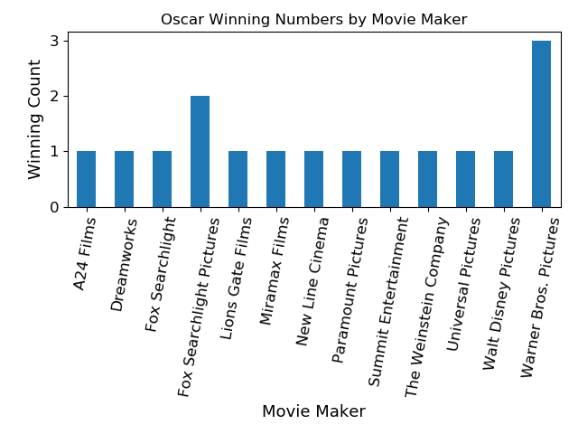
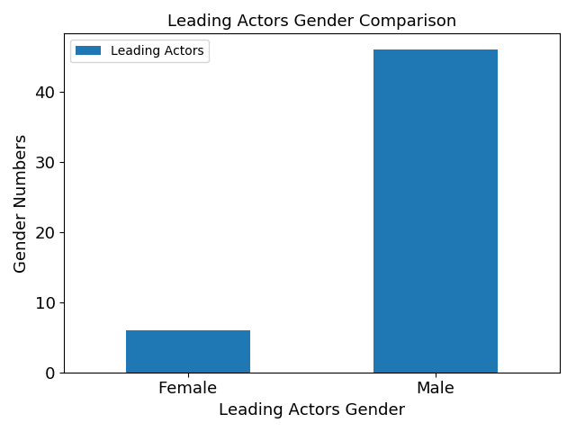
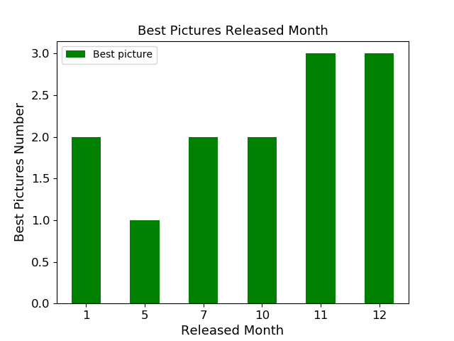

## Movie Popularity Trend
This is to find out the trends and correlation among Academy awarded movies for best pictures  
as movie popularity genre trend, actor’s sex orientation trend and movie release season trend  
- Tools: SQL, Python/Pandas/Matplotlib/Jupyter NB

### Oscar Best Pictures by Movie Maker

### #Box Office vs Review Score

### Leading Actors Gender Comparison

### Best Pictures Released Month

